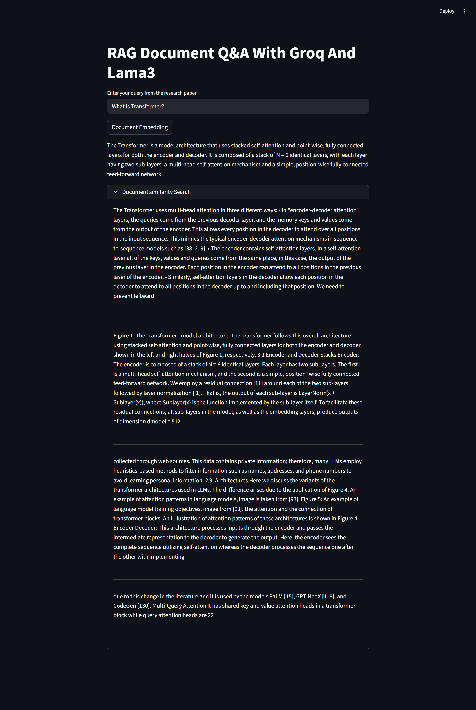

# RAG Document Q&A with Groq and Llama3

A Retrieval-Augmented Generation (RAG) application that lets you ask questions about your PDF research papers and get accurate, context-based answers powered by Groq's Llama 3.1 model.



## How It Works

1. **Document Ingestion** - PDF files from the `research_papers/` directory are loaded and split into manageable text chunks.
2. **Embedding & Indexing** - Each chunk is converted into a vector embedding using HuggingFace's `all-MiniLM-L6-v2` model and stored in a FAISS vector database.
3. **Retrieval** - When you ask a question, the most relevant document chunks are retrieved from the vector store using similarity search.
4. **Generation** - The retrieved chunks are passed as context to the Groq-hosted Llama 3.1 model, which generates an answer based strictly on the provided context.

## Tech Stack

| Component    | Technology                     |
| ------------ | ------------------------------ |
| UI           | Streamlit                      |
| LLM          | Llama 3.1 8B (via Groq API)    |
| Embeddings   | HuggingFace `all-MiniLM-L6-v2` |
| Vector Store | FAISS                          |
| Framework    | LangChain                      |
| PDF Parsing  | PyPDF                          |

## Project Structure

```
RAG-Document-Q&A/
├── main.py              # Main Streamlit application
├── requirements.txt     # Python dependencies
├── research_papers/     # Place your PDF files here
│   ├── Attention.pdf
│   └── LLM.pdf
├── app-screenshot.png   # Application screenshot
└── .env                 # Environment variables (create this)
```

## Prerequisites

- Python 3.10+
- A [Groq API key](https://console.groq.com/keys)

## Setup

1. **Clone the repository**

   ```bash
   git clone https://github.com/sothulthorn/RAG-Document-Q-A-with-Groq-and-Llama3.git
   cd RAG-Document-Q&A
   ```

2. **Create and activate a virtual environment**

   ```bash
   python -m venv .venv
   # Windows
   .venv\Scripts\activate
   # macOS/Linux
   source .venv/bin/activate
   ```

3. **Install dependencies**

   ```bash
   pip install -r requirements.txt
   ```

4. **Create a `.env` file** in the project root with your API key:

   ```
   GROQ_API_KEY=your_groq_api_key_here
   ```

5. **Add PDF files** to the `research_papers/` directory.

## Usage

1. **Start the application**

   ```bash
   streamlit run main.py
   ```

2. **Click "Document Embedding"** to load and index your PDFs. This only needs to be done once per session.

3. **Enter your question** in the text input and press Enter. The app will retrieve relevant document sections and generate an answer.

4. **Expand "Document similarity Search"** to view the source document chunks that were used to generate the answer.

## Configuration

| Parameter       | Location  | Default                | Description                           |
| --------------- | --------- | ---------------------- | ------------------------------------- |
| `model_name`    | `main.py` | `llama-3.1-8b-instant` | Groq LLM model                        |
| `model_name`    | `main.py` | `all-MiniLM-L6-v2`     | HuggingFace embedding model           |
| `chunk_size`    | `main.py` | `1000`                 | Character count per document chunk    |
| `chunk_overlap` | `main.py` | `200`                  | Overlapping characters between chunks |
| `docs[:50]`     | `main.py` | First 50 pages         | Number of document pages to process   |
